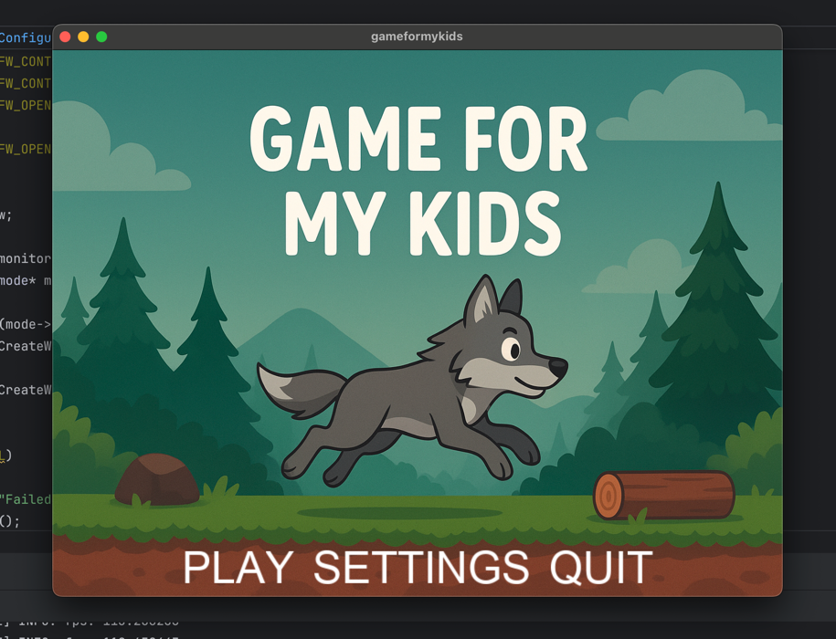
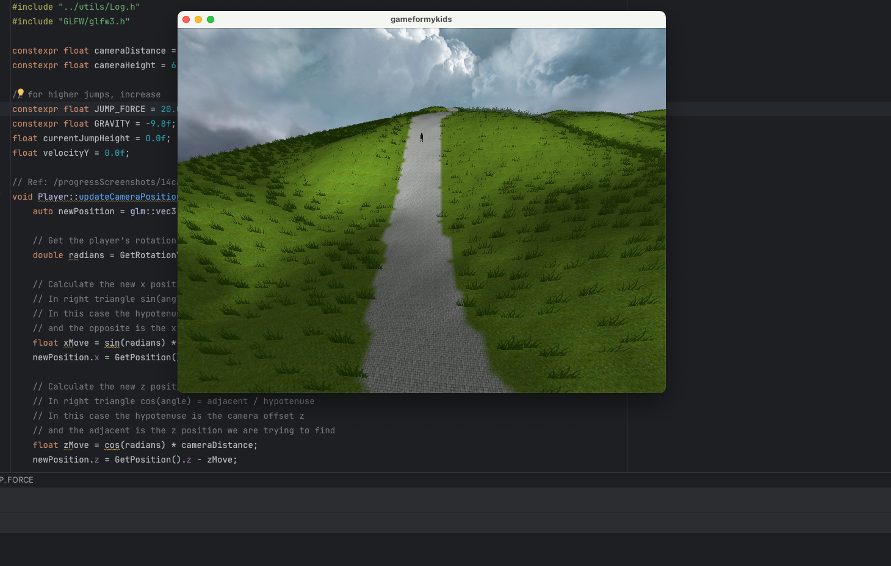

# gameformykids



I was always curious about how 3D games work and how are they created. To combine my curiosity with my kids possible 
future interest in games, I decided to create a simple game.

In the game a player (most likely kid) will be able to choose any animal as a player. This animal will move 
through the terrain on the predefined path. The terrain will contain obstacles that the player must jump over to continue.

To keep the game interesting, I'd like to create an eye-appealing terrain with many interesting details. That should
keep the kids interested in the game as well as allow to learn how such details are created in 3D games.

-- latest progress screenshot


## Progress tracking 

I decided to track the progress of features that I implement inside "progressScreenshots" directory. For anyone 
curious about the progress, you can check the screenshots there. For those who are interested in the code and 3D game
features, you can check the related commit that is attached with uploaded screenshot.

# Game features

- Model loading using assimp library [X]
- Terrain generation based on blendMap [X]
- Terrain height generation based on heightMap [X]
- Random grass placement on the terrain based on blendMap [X]
- Random player movement [X]
- Player movement along the created vector path [X]
- Camera following the player. Camera rotates based on player rotation. [X]
- Terrain face culling [X]
- Player's jump [x]
- Player's path following with start & end [x]
- Day Skybox [x] 
- Full screen mode [x]
- Night Skybox [ ]
- Player's animation [ ]
- Terrain EBO rendering [ ]
- Player's collision detection [ ]
- Lamps on the terrain [ ]
- Frustum culling [ ]
- Player's animal selection [ ]
- Very calming, relaxing, discovery, peaceful music [ ]
- Invention of game-edit tool (props placements) [ ]
- Water placement [ ]

# Having issues with CMake?

If you are having issues with CMake, try to set the policy version to 3.5.

Go to Settings → Build, Execution, Deployment → CMake → CMake options
Add:
```
-DCMAKE_POLICY_VERSION_MINIMUM=3.5
```

# GOTCHA's

## Namings to remember

- Normal - normal is a vector that is perpendicular to the surface of a triangle.

## Const before member function (const-qualified return type)

In C++, **const** before a function means the return value is constant (e.g., const int func()), so the caller cannot
modify the returned value **if it is a reference or pointer**.

```c++
const Player& getPlayer() {
    player.TraceGetted();
    return player;
}

getPlayer().SetHealth(100); // Error: cannot modify a const return value
getPlayer().GetHealth(); // OK
```

## Const after member function (const member function)

Then **const** after a member function (e.g., int func() const) means the function does not modify any member variables
of the class (except those marked as mutable). It guarantees the method is read-only with respect to the object's state.
This allows calling the function on const instances of the class.

```c++
const Player& getPlayer() const {
    return player;
}

getPlayer(); // no state change
getPlayer(); // no state change
getPlayer(); // no state change
```

## Templates

Templates in c++ were introduced to enable generic programming.

### Example

```c++
template <typename T>
T add(T a, T b) {
    return a + b;
}
```

## Pointer to an element of an array

I can create a pointer to a first element of an array like this

```c++
int arr[5] = {1, 2, 3, 4, 5};
int* p = array; // points to the first element of the array
```

and if I want to point to the second element of the array, I can do it like this

```c++
int* p = p + 1; // points to the second element of the array
```

## Std::copy functionality

std::copy allows me to copy subset of elements from one array to another

```c++
int arr1[5] = {1, 2, 3, 4, 5};
int arr2[2] = {0};

// i want arr2 to hold 4, 5
std::copy(arr1 + 3, arr1 + 5, arr2);
// arr2 now holds {4, 5}
```

## Cross product

The cross product of two vectors results in a third vector that is perpendicular to the plane formed by the first two vectors.

## Dot product

The dot product of two vectors results in a scalar value that represents the magnitude of one vector projected onto another.

## What is deltaTime?

Delta time is the time elapsed between the current frame and the previous frame. Basically, the faster the pc, the smaller the delta time.

## Std::variant functionality

std::variant is a type-safe union that can hold one of several types. It is useful when you want to store different types in a single variable.

To retrieve the value from a std::variant, you can use std::get or std::visit. To check which type is currently held by the variant, you can use std::holds_alternative.

## Exact Landing Time (`solveQuadratic`)

We can use this function to determine when a player will land on a flat surface during a jump

- Requires: starting height, vertical velocity, and gravity.
- Fast and simple; only handles vertical motion.
- Example use: jumping from a ledge, triggering a landing animation exactly on time.

## Trajectory Intersection with Terrain Plane (`planeTrajIntersection`)

We can use this function to find out where and when a player will land on uneven terrain while jumping

- Requires: terrain plane, player position, and 3D velocity vector.
- Handles horizontal and vertical motion, giving precise intersection point and time.
- Example use: jumping onto a hill, ramp, or irregular platform.