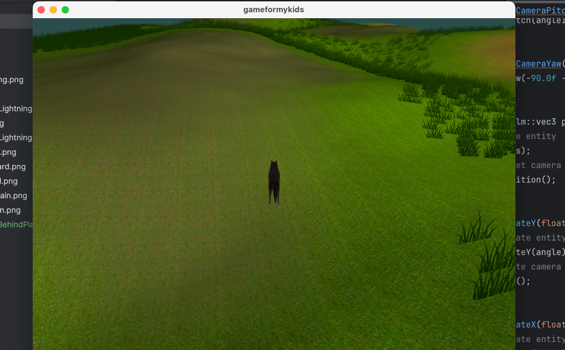

# gameformykids

I was always curious about how 3D games work and how are they created. To combine my curiosity with my kids' possible 
future interest in games, I decided to create a simple game for them.

In the game a player (kid) will be able to choose any animal as a player. This animal will follow
path on the terrain that will be full with obstacles. The player must jump above the obstacles to continue the path 
all the way to the finish.

-- latest progress screenshot


## Progress tracking 

I also decided to track the progress of features that I implement inside "progressScreenshots" directory. For anyone 
curious about the progress, you can check the screenshots there. For those who are interested in the code and 3D game
features, you can check the related commit that is attached with uploaded screenshot.

# Game features

- Model loading using assimp library [X]
- Terrain generation based on blendMap [X]
- Terrain height generation based on heightMap [X]
- Random grass placement on the terrain based on blendMap [X]
- Random player movement [X]
- Camera following the player. Camera rotates based on player rotation. [X]
- Terrain face culling [X]
- Terrain EBO rendering [ ]
- Player's terrain collision detection [ ]
- Player's jump [x]
- Player's path following with start & end [x]
- Player's animation [ ]
- Day Skybox [x] 
- Night Skybox [ ]
- Lamps on the terrain [ ]
- Frustum culling [ ]
- Player's animal selection [ ]
- ...

# Having issues with CMake?

If you are having issues with CMake, try to set the policy version to 3.5.

Go to Settings → Build, Execution, Deployment → CMake → CMake options
Add:
```
-DCMAKE_POLICY_VERSION_MINIMUM=3.5
```

# GOTCHA's

## Const before member function (const-qualified return type)

In C++, **const** before a function means the return value is constant (e.g., const int func()), so the caller cannot
modify the returned value **if it is a reference or pointer**.

```c++
const Player& getPlayer() {
    player.TraceGetted();
    return player;
}

getPlayer().SetHealth(100); // Error: cannot modify a const return value
getPlayer().GetHealth(); // OK
```

## Const after member function (const member function)

Then **const** after a member function (e.g., int func() const) means the function does not modify any member variables
of the class (except those marked as mutable). It guarantees the method is read-only with respect to the object's state.
This allows calling the function on const instances of the class.

```c++
const Player& getPlayer() const {
    return player;
}

getPlayer(); // no state change
getPlayer(); // no state change
getPlayer(); // no state change
```

